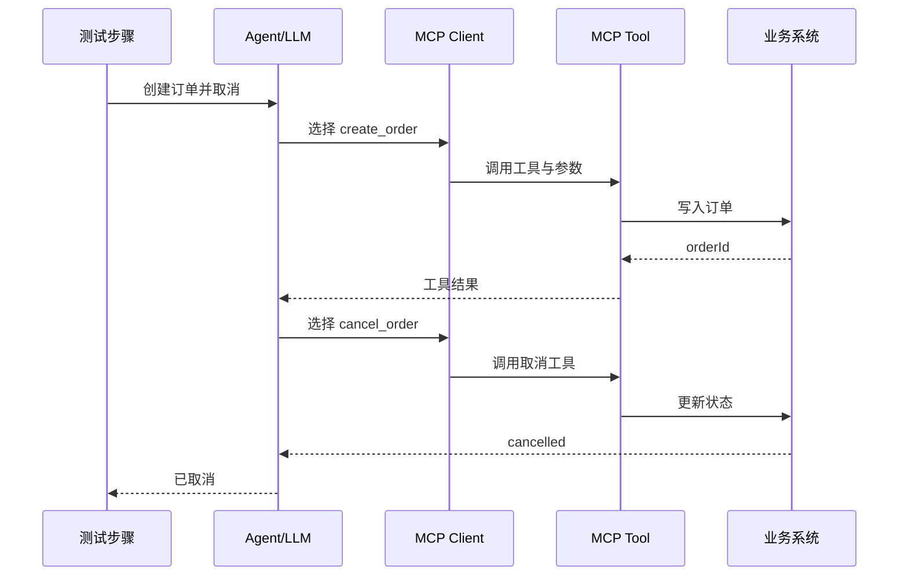
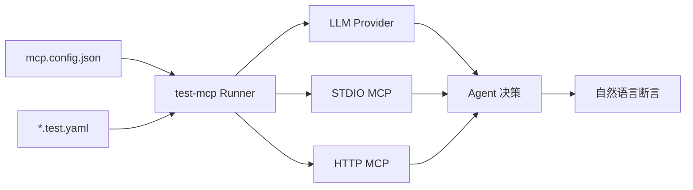

# Agent E2E 测试核心概念

上一步：[[08-学习与成长/下一代自动化测试学习路线/01-开始前的环境与安全准备|01-开始前的环境与安全准备]]  
下一步：[[03-Agent与AI测试/工具实战/test-mcp/02-test-mcp 安装与第一个测试|02-test-mcp 安装与第一个测试]]

## 1. 为什么 Agent 不能只测“回答内容”

普通聊天机器人可能只生成文本；工具型 Agent 会读取上下文、选择工具、构造参数、调用 MCP Server，再根据结果继续行动。



Agent 回复“已完成”并不能证明订单真的取消。端到端测试至少需要验证：

- 是否选择了正确工具；
- 参数是否正确且没有越权；
- 多轮上下文是否一致；
- 工具失败时是否诚实报告；
- 最终业务状态是否满足预期；
- Trace 是否能解释整个过程。

## 2. test-mcp 是什么

`test-mcp` 是一个用于自动测试 MCP Server 和 Agent 的无界面 MCP Client。它把三部分连在一起：

1. JSON 配置：LLM Provider 和 MCP Servers；
2. YAML 测试：自然语言 Prompt 和断言；
3. CLI Runner：执行测试并给出 Pass/Fail。



官方当前说明：

- MCP Transport：本地 STDIO、远程 HTTP；
- LLM Provider：OpenAI、Anthropic；
- MCP Tools：已支持；
- Resources、Prompts、Sampling：仍在 Roadmap；
- CI-friendly reports、测试参数化：仍在 Roadmap。

当前公开 npm 版本为 `@loadmill/test-mcp@0.1.5`，属于早期工具。它适合实验和补充 Agent/MCP 回归，不应直接按成熟企业测试框架评估。

## 3. 测试文件的最小结构

官方示例：

```yaml
description: "Dice roll with remote MCP server integration test"

steps:
  - prompt: "Roll a dice for me"
  - prompt: "Use the remote MCP server to list available remote servers, and tell me how many there are"
  - assert: "Both the dice roll and the remote server listing were executed successfully"
```

它表达的是一段共享上下文中的多轮流程：先执行 Prompt，再让 LLM 对自然语言断言作出判断。

> [!warning] 自然语言断言不是确定性数据库断言
> 断言也依赖 LLM 解释上下文，可能受模型、Prompt、随机性和返回内容影响。实现会把对话历史与客观 Tool Execution Log 一起交给评估器，并要求优先相信真实工具调用，但对支付、状态流转、权限等高风险业务仍应增加确定性的 API/数据库只读校验。

## 4. 五层测试模型

| 层 | 要验证什么 | 例子 |
|---|---|---|
| 意图 | Agent 是否理解任务 | “取消刚创建的订单”引用了正确订单 |
| 规划 | 是否选择正确顺序 | 先创建再取消，不跳步 |
| 工具 | 名称与参数是否正确 | `cancel_order(orderId)` |
| 结果 | 是否正确处理工具输出 | 超时后不宣称成功 |
| 业务 | 系统最终状态是否正确 | 状态确实为 `CANCELLED` |

test-mcp 主要覆盖意图到结果的 Agent/MCP 链路；业务层强断言需要你的 MCP 工具或外部确定性检查提供证据。

## 5. 它适合与不适合什么

### 适合

- 验证 MCP Tool 能否被 Agent 正确发现和调用；
- 验证 STDIO 与 HTTP MCP 的组合流程；
- 用自然语言编写多轮业务场景；
- 用 `--trace` 调试调用过程；
- 快速回归 Agent 的典型成功/失败路径。

### 暂时不要假设

- 已有成熟的 JUnit/Allure 式 CI 报告；
- 已支持任意目录递归发现和完整 Glob；
- 已支持 MCP Resources、Prompts、Sampling；
- 自带业务状态数据库断言；
- 自带 Prompt Injection 防护、Secret 脱敏和权限沙箱。

## 6. 官方资料

- [test-mcp 官方仓库](https://github.com/loadmill/test-mcp)
- [官方混合 Transport 测试](https://github.com/loadmill/test-mcp/blob/master/tests/mixed-transport.test.yaml)
- [官方 STDIO + HTTP 配置](https://github.com/loadmill/test-mcp/blob/master/test-mcp.config.json)
- [官方本地 Dice MCP Server](https://github.com/loadmill/test-mcp/blob/master/examples/dice-mcp-server.js)

## 本章自测

- [ ] 能解释为什么 Agent 回复正确不等于业务成功
- [ ] 能说清 Prompt、LLM、MCP Client、Tool 和业务系统的关系
- [ ] 知道自然语言断言的非确定性
- [ ] 知道当前已支持项与 Roadmap 项的区别
