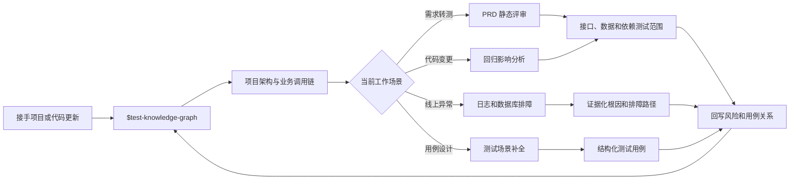

# 测试业务知识图谱 Skill 使用指南

> [!summary] 核心用途
> `$test-knowledge-graph` 是一个“项目测试地图生成器 + 日常测试导航工具”。它把代码中的 API、Controller、Service、DAO、数据库表、Redis、MQ、外部系统、定时任务、测试用例和风险点连接起来，帮助测试工程师快速理解项目、分析回归范围和定位排障路径。

## 一、当前项目如何查看

`recon-manager-service` 已生成测试业务知识图谱：

- 项目目录：`D:\fctproject\recon-manager-service`
- 图谱目录：`D:\fctproject\recon-manager-service\docs\test-knowledge-graph`
- 交互页面：`D:\fctproject\recon-manager-service\docs\test-knowledge-graph\web\index.html`
- [打开测试业务知识图谱页面](file:///D:/fctproject/recon-manager-service/docs/test-knowledge-graph/web/index.html)

当前页面包含约 9,447 个节点、39,113 条关系和 15 条重点业务流。

### 页面可以做什么

- 从“业务流程”下拉框选择支付、核销、应收等核心链路。
- 搜索 Controller、Service、API、数据库表、MQ Topic 或业务关键词。
- 点击节点查看源码位置、证据、上下游关系。
- 按模块、节点类型和可信度过滤。
- 沿调用关系分析故障传播、数据流和回归影响。

> [!tip] 推荐查看顺序
> 先选择业务流程，再查看入口 API，然后沿 `Controller → Service → Repository/Table → MQ/ExternalSystem` 向下追踪。不要一开始直接浏览全量节点，否则信息量会过大。

## 二、在新项目中使用 Skill

以后接手新项目时，在 Codex 新任务中直接输入：

```text
使用 $test-knowledge-graph 分析 D:\项目路径，
生成测试业务知识图谱、核心业务调用链、风险分析、
Neo4j 数据和可交互页面。
不要修改业务代码。
```

Skill 默认会完成：

1. 扫描仓库结构和技术栈。
2. 识别入口、API、Service、DAO、数据库、Redis、MQ、外部调用、配置、定时任务、异常和测试代码。
3. 提取核心业务域与关键调用链。
4. 生成测试视角的节点和关系数据。
5. 生成 Neo4j 可导入的 CSV/Cypher。
6. 生成离线可打开的交互页面。
7. 输出风险点、回归影响链和排障路径。
8. 默认写入项目的 `docs/test-knowledge-graph/`，不修改业务代码。

本机 Skill 位置：

```text
C:\Users\Farben\.codex\skills\test-knowledge-graph
```

## 三、和测试工作的结合方式



| 工作场景 | 知识图谱提供的信息 | 推荐组合 |
|---|---|---|
| 接手新项目 | 技术栈、模块、入口、表、MQ、外部依赖和核心流程 | `$test-knowledge-graph` |
| 需求评审 | 需求涉及的 API、服务、表、上下游和潜在遗漏 | 知识图谱 + `$prd-static-test-review` |
| 测试用例设计 | 正常、异常、幂等、缓存、MQ、数据一致性和外部故障场景 | 知识图谱 + `$smart-testcase-generator` |
| 代码改动回归 | 从变更类向上找业务入口，向下找数据库、缓存、MQ和测试用例 | 知识图谱 + `$analyze-regression-scope` |
| 线上问题排查 | 应检查的服务、日志、表、Topic、任务和外部系统 | 知识图谱 + `$fct-ops-troubleshoot` + `$elk-log` |
| Bug 复盘 | 故障节点、根因、影响流程、风险和补充用例 | 重新生成或补充图谱数据 |

## 四、常用提示词

### 1. 接手新项目

```text
使用 $test-knowledge-graph 分析 D:\xxx\new-service。
先告诉我项目技术栈、核心业务域、Top 10 业务调用链，
再生成可交互页面和 Neo4j 数据。
不修改业务代码。
```

### 2. 需求转测

```text
基于 D:\xxx\project 的测试业务知识图谱分析这份 PRD。
列出涉及的 API、Service、数据库表、Redis、MQ、
外部系统、定时任务和需要回归的历史流程。
然后生成测试场景。
```

### 3. 代码变更回归

```text
使用 $analyze-regression-scope 分析当前分支相对 master 的变更，
并结合项目测试业务知识图谱，输出受影响业务流、
接口、数据表、MQ、外部系统和建议回归用例。
```

### 4. 线上异常排查

```text
taskId=xxx 的支付任务状态没有更新。
先根据测试业务知识图谱定位完整调用链和排障节点，
再使用 $fct-ops-troubleshoot 和 $elk-log 做只读证据排查。
```

### 5. 测试用例补全

```text
根据“支付结果通知”业务流，
从正常、异常、重复通知、乱序、超时、事务一致性、
MQ 重试、缓存失效和外部系统故障角度补充测试用例。
```

### 6. 指定模块精确分析

```text
使用 $test-knowledge-graph 分析 D:\xxx\project，
本次重点覆盖 payment 模块，识别它的入口 API、核心 Service、
数据库表、Redis、MQ、外部依赖、定时任务和异常处理。
输出支付模块的关键业务流、风险点和排障路径。
```

## 五、推荐的日常工作节奏

### 项目首次接手

- 完整生成一次知识图谱。
- 先人工确认 5～15 条最重要的业务流。
- 检查业务名称、入口、数据库表和外部依赖是否准确。
- 将高风险链路列为冒烟和核心回归范围。

### 每次需求转测

- 用 PRD 中的关键词搜索图谱。
- 确认需求触达的入口 API 和完整下游依赖。
- 将表、缓存、MQ、外部系统和定时任务加入测试范围。
- 检查是否影响旧业务流和历史用例。

### 每次代码合并前

- 先分析 `base..head` 的代码变化。
- 将变更类映射到图谱节点。
- 沿关系向上追踪业务入口，向下追踪数据和外部依赖。
- 输出分层回归范围：冒烟、核心回归、扩展回归。

### 线上异常时

- 先用知识图谱回答“应该查哪里”。
- 再用日志、数据库和链路追踪回答“这一次实际发生了什么”。
- 将确认后的根因、风险和补充用例记录下来。

### 大版本或架构调整后

在项目根目录重新生成：

```powershell
cd D:\fctproject\recon-manager-service
python docs\test-knowledge-graph\tools\generate_graph.py
```

重新打开交互页面，确认节点数量、核心流程和关键依赖是否正常。

## 六、测试设计时重点关注的风险

从图谱中发现下面这些结构时，应优先补充测试：

- 一个业务流跨越多个服务或多个数据库事务。
- 状态更新同时依赖数据库、Redis 和 MQ。
- MQ 消费缺少明显的幂等或去重逻辑。
- 外部系统超时后存在重试、补偿或状态不同步风险。
- 定时任务和实时接口可能同时处理同一批数据。
- Controller 返回成功，但后续异步处理仍可能失败。
- 异常被统一捕获后，调用方无法区分失败原因。
- 多个 API 或业务流写入同一张核心表。
- 缓存更新和数据库提交顺序可能造成短暂不一致。
- 高风险代码没有对应的测试用例节点。

## 七、图谱证据如何理解

> [!warning] 静态图谱不等于运行时事实
> 知识图谱主要来自代码、配置和 SQL 的静态证据。它适合分析系统结构和可能的影响范围，但不能代替真实环境中的日志、数据库记录、Trace 和 MQ 消费结果。

可信度使用建议：

- 高可信度：源码直接调用、注解、SQL、配置中有明确证据，可直接用于分析。
- 中可信度：通过命名、接口实现或跨模块引用推断，需要结合源码确认。
- 低可信度：关键词或业务语义推断，只用于发现线索，不直接作为结论。

推荐先查看可信度 `>= 0.75` 的节点和关系，再按排查需要扩大范围。

## 八、最实用的工作模型

```text
知识图谱：系统怎么连接、改动可能影响哪里、故障应该查哪里
运行证据：这一次请求、任务或数据实际上发生了什么
测试资产：应该如何验证、哪些用例需要新增或回归
```

三者结合：

```text
代码与配置
    ↓
测试业务知识图谱
    ↓
需求评审 / 回归分析 / 线上排障
    ↓
日志、数据库、Trace 验证
    ↓
测试用例、风险和 Bug 复盘
    ↓
持续更新知识图谱
```

## 九、相关笔记

- [[07-工具与工作流/Codex与Skills/Agent Skill 从本地整理到 GitLab 发布完整流程|Agent Skill 从本地整理到 GitLab 发布完整流程]]
- 测试总结（含敏感资料，仅本地归档，不同步）
