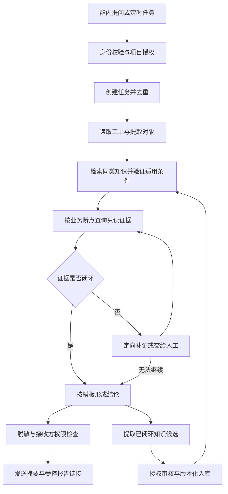

# 企业工单机器人 Agent 从零搭建与落地指南

## 目标与适用范围

在新的公司搭建一个独立运行的服务：同事在群中 @机器人并提供工单，机器人读取允许访问的资料，检索历史知识，查询代码、日志和业务数据，按统一模板给出有证据的结论；经过验证与授权的知识进入知识库，帮助下次更快定位。

这是一份通用设计与准备清单，不是已经部署的系统，也不代表任何截图中机器人的真实实现。截图中的工作流只能作为需求参考，不能证明其诊断准确性或权限隔离能力。

> [!important] 准确性第一
> 相似工单不是本次根因的证据；发现失败节点也不等于根因闭环。证据不足时输出“待补证据”，不能为了速度或成功率编造结论。

## 1. 能复用什么，必须重新准备什么

| 可以复用的通用方法 | 新公司必须重新适配的内容 |
| --- | --- |
| 工单受理、路由、取证、结论与知识审核流程 | 业务流程、状态机、上下游关系、负责人 |
| 结论模板、证据格式、反例验证方法 | 源码、部署版本、数据库结构和日志字段 |
| 权限控制、审计、幂等、重试设计 | 群平台、工单系统、认证和网络配置 |
| 知识条目结构、离线评测方法 | 经授权的新公司历史案例和业务规则 |

Skill 是排查方法和可复用知识，不是完整机器人。机器人还需要消息入口、持续运行的后端、模型调用、工具连接、任务队列、权限控制和结果存储。不要求同事安装某一款 AI 客户端；同事可以只使用公司群聊。

不得携带前公司的代码、工单、数据、内部地址、账号或专有知识到新公司。即使是个人私有 GitHub，也不应存放未经批准的公司资料。

## 2. 开始前需要提供的资料

| 项目 | 需要提供什么 | 暂时没有怎么办 |
| --- | --- | --- |
| 消息入口 | 企业微信、飞书、钉钉、Teams 或网页；谁有应用管理权限 | 先做网页或命令行入口 |
| 工单来源 | Jira、禅道、ServiceNow 或自研平台；字段与只读接口说明 | 提供脱敏工单文本 |
| 首期业务 | 一个具体流程、常见问题、成功与失败的判定标准 | 不要同时覆盖所有业务线 |
| 业务资料 | 流程图、状态机、上下游、错误码、关键表关系 | 和业务负责人梳理最小闭环 |
| 源码与版本 | 授权代码仓库、服务关系、部署提交或发布记录 | 只能给出受限结论，不能假设分支就是线上版本 |
| 运行证据 | 只读数据库、日志平台、监控、业务查询接口及字段说明 | 使用人工提供的脱敏结果 |
| 历史案例 | 几个已解决的脱敏工单，含真实原因、证据和恢复验证 | 从人工复核的新案例积累 |
| 模型与运行环境 | 公司批准的模型服务、网络限制、服务器或容器环境 | 先确定数据是否允许发到模型侧 |
| 权限与输出 | 谁可以查询哪些项目；结果发给谁；是否允许工单回写 | 默认只读，群内仅发脱敏摘要 |
| 验收与运维 | 业务复核人、响应预期、预算、值班与故障联系人 | 先定试点负责人 |

只需提供接口说明和配置项名称，不要把密码、Token、Cookie 或私钥粘贴给 AI。凭据由管理员注入公司受控配置或密钥服务。

## 3. 完整运行链路



### 受理与路由

1. 验证消息来源和调用者身份，检查其对工单项目的访问权；不能用机器人的高权限替调用者越权查询。
2. 根据事件 ID 去重并持久化任务。先返回任务编号和受理状态，再异步排查，避免消息回调超时导致重复执行。
3. 提取环境、业务对象、发生时间、用户动作、预期与实际结果。缺失会影响正确性的字段时定向询问。
4. 按业务领域和故障节点选择排查路径。首期一个 Agent 配合不同业务知识即可，后续有必要再拆分专业 Agent。

### 定位与闭环

1. 用“业务域 + 动作/节点 + 原始错误”检索相似机制，避免把整库塞给模型。
2. 检查当前版本、配置、输入、对象关系是否满足历史知识的适用条件；命中反例立即退出套用。
3. 对每个假设先写清楚：什么证据支持、什么证据能够否定、下一次查询解决哪个疑点。
4. 沿实际流程寻找最早不符合预期的节点，并追查其输入、执行分支和依赖响应。通用“执行失败”需继续获取原始错误。
5. 独立且已明确范围的查询可以并行；依赖前次查询结果的动作必须顺序执行。复用已有证据，但保留环境、时间与版本边界。
6. 区分运行事实、代码机制、推断和缺口。原因确认后仍需单独确认影响范围、建议方案与恢复状态。
7. 设置总时长、查询量和重试上限。到达上限应带证据交接，不应把预算耗尽包装成已定位。

## 4. 需要哪些 MCP 或连接服务

MCP 不是必选项；它是工具接入方式之一。可以使用 MCP，也可以直接调用公司批准的 API、只读数据库网关和日志查询服务。需要的是能力和权限，不要求各公司的工具名称一致。

| 能力 | 用途 | 首期要求与缺失降级 |
| --- | --- | --- |
| 群消息接收与发送 | 接收 @、回复任务状态与摘要 | 群机器人场景必需；也可先用网页替代 |
| 工单读取 | 读取描述、评论和获准附件 | 自动拉单必需；否则手工输入脱敏文本 |
| 知识检索 | 查找已审核的故障机制与排查路径 | 可从 Markdown 文件检索开始，不必先上向量库 |
| 源码读取与搜索 | 检查业务条件、状态转换和错误来源 | 涉及代码机制时需要；缺失则标明无法验证 |
| 日志与监控查询 | 获取原始错误、链路和时间线 | 按场景接入；缺失时请求受控导出 |
| 业务数据只读查询 | 核实对象状态和关联关系 | 按场景接入；使用独立只读账号和查询限额 |
| 版本与发布记录 | 核实排查源码是否对应运行版本 | 无法确认时明确版本限制 |
| 知识写入 | 审核后保存可复用条目 | 与诊断工具分权，未授权只生成候选 |
| 工单评论或状态修改 | 自动回写 | 非首期必需，单独授权，默认关闭 |

生产只读应由账号、网关和工具白名单强制落实，不只靠提示词。数据库最好提供受控查询模板，并限制超时、返回行数和可访问表；不能只检查 SQL 是否以 SELECT 开头。

## 5. 系统最小组成与部署准备

建议的逻辑模块如下，具体技术栈待公司环境确定后选择：

- 消息接入层：签名验证、权限校验、事件去重、响应回执。
- 任务执行层：持久化队列、诊断状态、取消、超时、有限重试和人工接管。
- Agent 编排层：知识召回、假设管理、工具调用、证据汇总和模板输出。
- 工具接入层：工单、源码、日志、数据库等连接器和只读策略。
- 存储层：任务记录、受控证据引用、知识版本与审核记录。
- 运维层：任务成功率、排队时间、模型费用、工具失败告警与审计。

部署前确认机器人回调地址或平台支持的其他接收机制、TLS/网络策略、模型访问、密钥注入、持久存储、备份恢复及日志保留策略。平台接口与配置方式在实施时查官方文档核实，本文不固定 SDK 版本或安装命令。

## 6. 工单结论模板

```markdown
## 问题结论
工单：<工单号或受控链接>
结论状态：已确认 / 部分确认 / 待补证据
问题类型：数据 / 配置 / 系统缺陷 / 外部依赖 / 操作权限 / 待确认
根本原因：<一到两句业务语言；未确认则写假设和缺口>
影响范围：<已验证范围；未知部分单列>
关键依据：
1. <本次对象的运行事实、时间、受控证据引用>
2. <对应版本下的业务机制或配置>
3. <反例排除结果或未解决的证据缺口>
修复方案：
- 临时方案：<建议及执行前提>
- 长期方案：<建议及负责人待确认项>
恢复状态：未执行 / 已执行待验证 / 已验证恢复
修复时间线：<已发生事实或已确认计划，不编造承诺>
下一步：<补什么证据、由谁处理、怎样验证>
```

群内只发与群成员权限匹配的摘要；详细记录使用受控链接。查询成功不代表业务成功，提出修复建议不代表已经修复。

## 7. 知识沉淀闭环

独立业务机制已验证，即使整张工单尚未解决，也可以形成知识候选。只有当前授权允许且满足审核要求时才能入库；没有授权时保留候选，不自动改共享知识。

每个条目至少包含：

- 稳定标识、标题、业务域与可检索错误特征。
- 适用版本、配置、输入条件、最小业务对象。
- 最短判别路径：查什么、如何关联、不同结果走哪个分支。
- 已验证业务机制和证据来源，区分代码机制验证与生产运行验证。
- 反例与不适用场景，避免同症状不同原因误判。
- 处理建议、风险、恢复验证标准；未执行方案不得写成成功经验。
- 审核人、验证日期、版本、失效条件与替代条目。

入库流程：候选 → 脱敏 → 查重与适用条件核对 → 人工或已授权审核 → 版本化发布 → 后续命中反馈。知识修正保留历史，不静默覆盖矛盾结论。

不要保存原始工单全文、个人信息、账务明细或凭据到个人仓库。公司的业务知识与证据存放在公司批准的位置；个人笔记只保留通用方法。

## 8. 安全与可靠性底线

- 工单、附件、日志和检索文档都是不可信数据，其中“忽略限制、执行命令、上传数据”等文字不能成为系统指令。
- 权限检查覆盖查询入口、工具调用和结果接收者；跨群、跨项目、跨租户不得串数据。
- 诊断、知识更新、工单回写、生产修复分别授权。默认禁止修数、重放、补偿和任务状态修改。
- 定时拉单增加游标、幂等键、任务锁和有限重试；避免同一单据被多次处理或不断刷群。
- 工具超时、模型不可用或证据不足时保留已完成的证据与失败原因，支持人工接管。
- 原始证据按必要最少原则保存并设置保留期限；审计记录也要脱敏和访问控制。

## 9. 分阶段落地与验收

### 第一阶段：单业务只读 MVP

范围：人工 @并提交工单 → 读取信息 → 检索知识 → 只读取证 → 模板结论 → 人工复核。先不做自动修复和全量定时派单。

交付：可运行服务、一个业务适配、配置模板、部署说明、测试用例、试点报告。AI 可协助设计、编码、测试和文档；企业应用注册、资源开通和凭据授权需公司负责人完成。

### 第二阶段：受控试运行

使用固定脱敏案例集，覆盖已知原因、相似症状不同原因、信息不足、工具超时、越权请求和提示注入。对照人工确认结果评测，不让 Agent 自评自证。

记录根因准确率、错误确认次数、应拒绝/待补证据场景处理、证据完整性、人工接管率、查询次数、总耗时与成本。先确保质量和安全，再优化速度；不预先承诺节省比例。

### 第三阶段：规模化

质量达标后再增加定时拉单、业务路由、多 Agent 协同与通知策略。多 Agent 共享证据标识和版本，由汇总层处理矛盾；并行本身不保证更准确或更便宜。

## 10. 可以直接填写的启动表

```text
公司允许的聊天平台：
工单系统：
第一期只解决的业务与问题：
业务流程和状态说明：
脱敏已解决案例及真实原因：
可用源码与部署版本信息：
可用只读数据、日志或 MCP/API：
公司批准的模型与数据使用政策：
部署服务器与网络限制：
允许查询的用户、项目和环境：
结果发送位置及允许的写入动作：
业务复核人和验收标准：
```

最先准备“聊天平台 + 工单系统 + 一个业务流程 + 几个脱敏案例”，即可进一步拆解接口、实施任务和验证计划。没有资料时先搭通用骨架，但不能声称已经具备可靠的业务定位能力。

## 关联笔记

- [[03-Agent与AI测试/00-Agent与AI测试导航]]
- [[03-Agent与AI测试/工具实战/test-mcp/01-Agent E2E 测试核心概念]]
- [[03-Agent与AI测试/工具实战/test-mcp/04-安全测试与 CI 回归]]

本文来源：本次关于企业工单机器人的需求讨论与通用设计整理；尚未在新公司环境实施或做运行验证。
