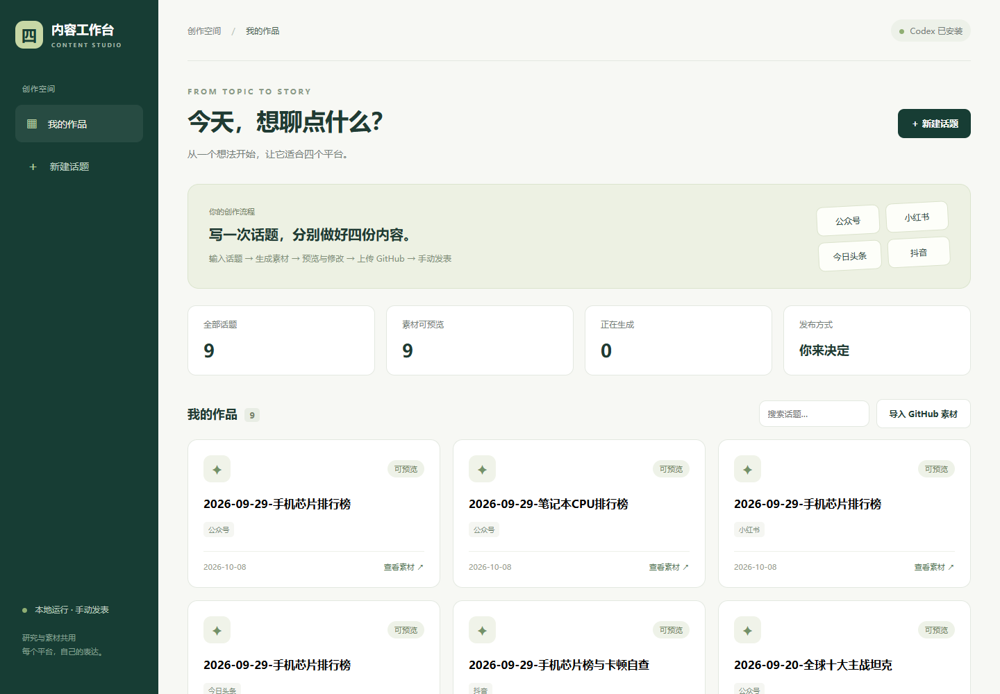
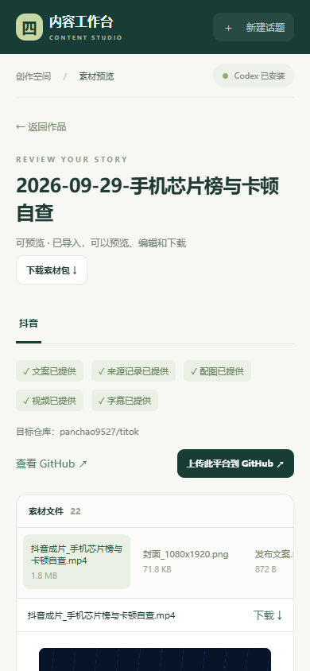

# 四平台内容工作台：从这里开始

你可以在页面输入一个话题，分别生成公众号、小红书、今日头条、抖音素材。素材自动保存在运行电脑的本地文件夹，检查后再上传 GitHub，由你手动到各个平台发表。

## 家里电脑怎样开始

**先下载两个文件：**

- [程序包](四平台内容工作台_程序包.zip)
- [已有作品备份](四平台内容工作台_已有作品备份.zip)

在 GitHub 打开 ZIP 文件后，点击 **Download raw file / 下载原始文件**。也可以使用仓库顶部的 **Code → Download ZIP** 下载整个仓库后找到这个目录。

**然后解压：**

1. 解压程序包，得到 `content-studio` 文件夹，放到你自己的固定位置，例如 `D:\ContentStudio\content-studio`。
2. 想继续使用此前作品时，把“已有作品备份”解压到这个 `content-studio` 文件夹里。最后 `server.py` 和 `data` 文件夹应该在同一层。先恢复备份，再启动。备份不要覆盖你后来已经产生的新作品数据库。
3. 双击 `start-local.cmd`。启动窗口会显示页面地址和本次的配对码。
4. 打开 `http://127.0.0.1:8765`，输入启动窗口中的配对码。以前聊天里的配对码不会沿用。

已准备好运行环境的 Windows 电脑，日常使用只需第 3、4 步。启动窗口要保持运行；浏览器关闭不影响后台任务。

<details>
<summary>第一次使用：准备环境（只需要做一次）</summary>

电脑需要 Python 3.10 或更新版本、Git、Node.js。安装 Python 时勾选加入 PATH。打开终端检查：

```powershell
python --version
git --version
node --version
```

安装并登录 Codex：

```powershell
npm install -g @openai/codex
codex login
```

使用自己的 ChatGPT 账号登录，生成使用该账号的 Codex 额度，本系统不用填写 API key。需要图片和视频制作依赖时：

```powershell
python -m pip install pillow imageio-ffmpeg
```

上传 GitHub 前，使用 Git Credential Manager 登录能访问 `panchao9527` 仓库的 GitHub 账号，并设置自己的 Git 提交姓名和邮箱。如果你以前已配置 Git，可继续使用原配置。可检查仓库访问：

```powershell
git ls-remote https://github.com/panchao9527/weixin.git
```

在 Mac 上，安装相同运行工具后，在 `content-studio` 目录使用 `python3 server.py` 启动本机模式；手机模式使用 `python3 server.py --host 0.0.0.0`。本次验证环境是 Windows，Mac 尚未实测。

</details>

## 以后每天怎么用

**新建话题 → 输入内容 → 创建并生成 → 自动保存本地 → 检查与修改 → 上传 GitHub → 手动发表。**

- 点击已有作品，可以看文案、图片、音频、视频和来源说明。
- 生成的素材自动保存，编辑文案后点击“保存修改”。改动 Markdown 不会自动重做 HTML、配图或视频，请检查这些版本的一致性。
- “上传此平台到 GitHub”只上传当前平台的素材。上传后本地文件仍然保留。
- “下载素材包”可以取得整个话题的 ZIP，“下载”可以取得单个文件。
- 素材位置：`content-studio/data/tasks/`。作品备份可以运行 `python backup.py --output 作品备份.zip` 导出；等生成结束再备份。

| 平台 | 上传目标 |
| --- | --- |
| 公众号 | `panchao9527/weixin` |
| 小红书 | `panchao9527/xiaohongshu` |
| 今日头条 | `panchao9527/jinritoutiao` |
| 抖音 | `panchao9527/titok` |

## 手机访问

在个人电脑上关闭本机模式的启动窗口，再双击 `start-lan.cmd`。电脑与手机连接同一 Wi-Fi，手机浏览器输入启动窗口显示的手机地址，再输入配对码。

如果防火墙询问，仅允许你自己的专用网络。电脑需要保持开机，程序需要保持运行。不要把服务端口开放到公网。

## 页面长这样





## 当前版本的验证范围

2026-10-08 已通过 7 项自动化测试，并检查桌面及手机宽度页面、已有视频加载、文案编辑保存和跨目录迁移。GitHub 上传流程在临时本地 Git 仓库实测。完整新话题自动生成、网页向真实 GitHub 推送、个人电脑手机同一 Wi-Fi 真机访问尚未实跑；发生错误时页面会显示日志并保留已有素材。

程序包内有更完整的 `README.md` 和 `验证记录.md`。视频生成取决于本地媒体工具及 Codex 的执行情况，缺少产物会标为“素材待补齐”。

本目录不包含公司电脑的登录凭据、配对会话或生成运行日志。家里电脑重新登录后使用。
