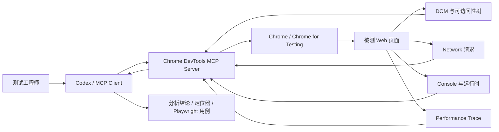
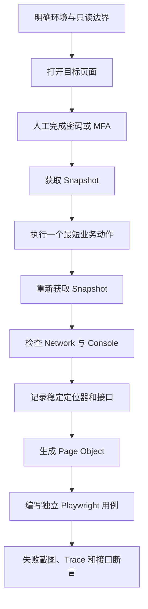

# Chrome DevTools MCP 技术指南

> [!summary] 一句话理解
> Chrome DevTools MCP 把 Chrome DevTools 的页面操作、DOM 快照、Console、Network、性能追踪等能力，通过 MCP 暴露给 Codex 等 AI Agent。它特别适合“探索真实页面并收集证据”，再将稳定流程沉淀成 Playwright Page Object 和自动化用例。

> [!warning] 安全边界
> Agent 可以读取和操作所连接浏览器中的页面、Cookie 所代表的登录会话、Network 请求和页面数据。企业系统应使用专用测试账号和独立浏览器配置，不连接个人日常 Chrome；不要把密码、Token、Cookie、Authorization 请求头或真实业务数据写入 Prompt、日志、截图和公开笔记。

## 一、它解决什么问题

传统 AI 只能读取源码或静态 HTML，很难确认真实运行页面中的动态组件、接口请求、Console 错误和性能瓶颈。Chrome DevTools MCP 让 Agent 能够连接一个真实 Chrome，并使用 DevTools 能力完成：

- 打开、切换和关闭标签页。
- 获取页面语义快照，识别按钮、输入框、表格和菜单。
- 点击、输入、上传文件、处理浏览器弹窗。
- 查看 Console 消息和带 Source Map 的错误栈。
- 查看 Network 请求、状态码、请求方式和响应信息。
- 截图、模拟视口、网络和 CPU 条件。
- 记录 Performance Trace，分析 LCP、INP、CLS 等问题。
- 在明确授权下检查已登录系统中的真实交互流程。

官方将它定位为面向编码 Agent 的 Chrome DevTools MCP Server，底层使用 Chrome DevTools 与 Puppeteer 提供浏览器控制、调试和自动等待能力。

## 二、整体工作原理



核心链路是：

```text
自然语言任务
  → Agent 选择 MCP 工具
  → MCP Server 通过 DevTools 协议操作 Chrome
  → 返回页面快照、请求、日志或性能证据
  → Agent 基于证据继续操作或生成代码
```

MCP 负责“让 Agent 调用工具”，Chrome DevTools Protocol 负责“让工具检查和控制浏览器”，Puppeteer 负责部分自动化动作和等待。

## 三、主要工具能力

工具名称会随版本演进，当前应以官方 Tool Reference 为准。日常 Web 测试最常用的是以下几组：

| 能力组 | 常用工具 | 测试用途 |
|---|---|---|
| 页面导航 | `list_pages`、`new_page`、`select_page`、`navigate_page`、`wait_for` | 打开系统、切换标签页、等待业务状态 |
| 页面理解 | `take_snapshot` | 获取带元素标识的语义快照，识别稳定控件 |
| 页面操作 | `click`、`fill`、`fill_form`、`press_key`、`hover`、`upload_file` | 执行业务操作和表单填写 |
| 页面证据 | `take_screenshot` | 保存视觉证据，辅助确认布局和失败现场 |
| 网络分析 | `list_network_requests`、`get_network_request` | 定位接口、状态码、请求方式和响应 |
| Console 调试 | `list_console_messages`、`get_console_message` | 查 JavaScript 报错、资源错误和警告 |
| 脚本检查 | `evaluate_script` | 读取必要的页面运行时状态；不应用来绕过正常业务操作 |
| 性能分析 | `performance_start_trace`、`performance_stop_trace`、`performance_analyze_insight` | 分析加载性能和 Core Web Vitals |
| 环境模拟 | `emulate`、`resize_page` | 验证移动视口、弱网、离线、CPU 降速和深色模式 |

### Snapshot 和 Screenshot 的区别

| 对比项 | Snapshot | Screenshot |
|---|---|---|
| 表达内容 | 页面语义结构、可访问性信息和元素标识 | 页面像素画面 |
| 适合用途 | 找按钮、输入框、表格、文本和可操作节点 | 看布局、遮挡、样式、图表和视觉异常 |
| Agent 操作 | 通常可直接基于 snapshot 中的元素标识点击或输入 | 需要视觉判断，坐标操作稳定性较低 |
| 推荐优先级 | 优先 | 作为补充证据 |

> [!tip] 稳定操作原则
> 每次页面跳转或大范围变化后重新获取 Snapshot。定位优先使用 `id`、`data-testid`、role、label 和稳定业务文本，避免动态 UUID、随机 class、坐标和超长 XPath。

## 四、安装与配置

### 4.1 环境要求

- Node.js LTS。
- npm / npx。
- 当前稳定版 Chrome 或更新版本。
- 支持 MCP Server 的客户端，例如 Codex、Gemini CLI、Claude Code、Cursor 或 VS Code。

### 4.2 Codex 安装命令

官方给出的 Codex 安装方式：

```powershell
codex mcp add chrome-devtools -- npx chrome-devtools-mcp@latest
```

Windows 如果客户端不能直接启动 `npx`，可以让 `cmd /c` 负责解析：

```toml
[mcp_servers.chrome-devtools]
command = "cmd"
args = ["/c", "npx", "-y", "chrome-devtools-mcp@latest"]
startup_timeout_sec = 20
```

修改 MCP 配置后通常需要重启或重新加载客户端，新的工具才会进入当前会话。

### 4.3 推荐的企业测试安全配置

```toml
[mcp_servers.chrome-devtools]
command = "cmd"
args = [
  "/c",
  "npx",
  "-y",
  "chrome-devtools-mcp@latest",
  "--isolated",
  "--no-usage-statistics",
  "--no-performance-crux",
  "--redact-network-headers"
]
startup_timeout_sec = 20
```

参数含义：

| 参数 | 作用 | 测试建议 |
|---|---|---|
| `--isolated` | 使用临时用户数据目录，关闭后自动清理 | 企业系统默认开启，避免复用个人浏览器数据 |
| `--no-usage-statistics` | 关闭 MCP Server 使用统计 | 企业环境建议开启此禁用项 |
| `--no-performance-crux` | 不向 CrUX API 发送 Trace 中的 URL | 内部 UAT、SIT 地址建议关闭 CrUX 查询 |
| `--redact-network-headers` | 返回给客户端前脱敏敏感 Network Header | 建议始终开启，但仍不能把返回结果视为绝对无敏感信息 |
| `--headless` | 无界面运行 Chrome | CI 或无需人工登录时使用 |
| `--slim` | 只暴露导航、脚本和截图等精简工具 | 简单浏览任务可降低工具选择成本 |

> [!note] `--isolated` 与登录态
> 隔离模式的浏览器配置会在会话结束后清理，因此不会长期保存 SSO 登录态。这对探索更安全；需要稳定回归时，应把登录流程或 Playwright `storage_state` 管理放进自动化框架，并按 SIT/UAT/PROD 分环境保存，不能共用同一个状态文件。

### 4.4 连接已有 Chrome

默认情况下 MCP Server 会启动自己的 Chrome。只有确实需要复用已登录会话时，才考虑连接现有浏览器：

- Chrome 144+：在 `chrome://inspect/#remote-debugging` 启用远程调试，再配置 `--autoConnect`。
- 手工端口：使用独立用户数据目录启动 Chrome，并配置 `--browser-url=http://127.0.0.1:9222`。

```json
{
  "mcpServers": {
    "chrome-devtools": {
      "command": "npx",
      "args": [
        "-y",
        "chrome-devtools-mcp@latest",
        "--browser-url=http://127.0.0.1:9222"
      ]
    }
  }
}
```

> [!danger] 不要连接日常浏览器
> 连接已有 Chrome 后，Agent 会继承其中的账号、Cookie 和页面数据。应使用专门的测试 Chrome Profile，并在操作前明确限定目标环境、允许的业务动作和禁止的写操作。

## 五、推荐的页面探索流程



推荐按以下节奏工作：

1. 先声明目标环境、业务范围和禁止动作，例如“仅查询和查看，不新增、不删除、不审批”。
2. 打开系统登录入口，账号、密码和 MFA 由测试人员手工输入。
3. 登录后获取 Snapshot，理解菜单、页面结构和可操作元素。
4. 只执行一次最短成功流程，不要一开始遍历大量数据。
5. 在关键动作前后查看 Network 请求，记录方法、路径、HTTP 状态和业务码。
6. 查看 Console 是否有脚本报错、资源加载失败或权限异常。
7. 记录稳定定位器、URL 规律、页面字段和加载完成标志。
8. 将探索结果写入 Page Object，不在测试用例中堆积选择器。
9. 用 Playwright 独立执行正式回归，并保存失败截图、Trace 和脱敏日志。

### 可复用 Prompt 模板

```text
使用 Chrome DevTools MCP 打开 <UAT 地址>。
账号、密码和 MFA 由我手工输入，请不要读取或记录凭据。

完成 <查询对象> 的查询和进入详情流程，只允许只读操作：
- 不新增、不修改、不删除、不导出、不审批；
- 记录稳定的 id、role、label、data-testid 或业务文本；
- 记录关键接口的方法、路径、HTTP 状态和业务码；
- 检查 Console 错误和失败请求；
- 不输出 Cookie、Token、Authorization Header 和真实业务数据。

探索完成后，在当前自动化项目中生成 Playwright Python Page Object 和用例，
地址从多环境配置读取，登录态按环境隔离，并加入接口状态、页面字段、
失败截图和 Trace 断言。不要把 UAT 地址写死在代码中。
```

## 六、如何沉淀成 Playwright 自动化

Chrome DevTools MCP 和 Playwright 不是互相替代关系：

| 阶段 | 推荐工具 | 原因 |
|---|---|---|
| 首次理解陌生页面 | Chrome DevTools MCP | 能同时看 DOM、Network、Console 和运行时状态 |
| 识别稳定定位器 | Chrome DevTools MCP + DevTools | 通过真实页面确认 role、label、id 和加载行为 |
| 一次性问题定位 | Chrome DevTools MCP | 交互探索快，便于追问和收集证据 |
| 长期回归测试 | Playwright + Pytest | 代码可审查、可重复、可进 CI、断言和报告稳定 |
| 接口大批量组合 | API 自动化 | 比 UI 更快、更稳定，适合参数和边界覆盖 |

建议的代码结构：

```text
config/
  config.yaml                 # SIT/UAT/PROD 地址和非敏感配置
pages/
  <system>/
    login_page.py             # 登录完成判断、登录态保存
    query_page.py             # 查询和详情 Page Object
testcases/web/<system>/
  conftest.py                 # 按环境加载 storage_state
  test_query.py               # 业务断言
scripts/
  capture_auth.py             # 人工登录后采集登录态
.auth/
  <system>-sit.json           # 必须加入 .gitignore
  <system>-uat.json
```

测试代码应做到：

- `base_url` 从 `config.yaml` 按 `--env` 读取。
- Page Object 只封装页面定位与业务动作。
- 测试用例描述业务预期，不重复选择器。
- 登录态按环境隔离，`.auth/` 禁止提交。
- 同时断言页面结果、关键接口 HTTP 状态和业务码。
- 失败时保留 Screenshot、Playwright Trace 和脱敏日志。
- 动态测试数据优先从只读查询结果中选择，避免写死会过期的数据。

## 七、测试工作中的典型场景

### 7.1 页面功能探索

适合接手陌生系统时快速回答：

- 从哪个菜单进入目标页面？
- 页面加载会调用哪些接口？
- 查询条件的必填规则是什么？
- 列表进入详情时传递什么标识？
- 页面展示字段来自哪个接口响应？

### 7.2 前后端联调排错

```text
页面现象
  → Console 是否报错
  → Network 是否发出请求
  → HTTP 状态是否正常
  → 业务码和 data 是否正确
  → 页面是否完成渲染
```

这样可以初步区分：前端没有发请求、网关/权限失败、后端业务失败、响应正常但前端渲染失败。

### 7.3 性能分析

Performance 工具可记录 Trace，并针对 LCP、INP、CLS、文档延迟等 Insight 给出分析。内部系统建议关闭 CrUX URL 查询，只使用本地实验数据；测试结果还应结合固定设备、网络条件和多次采样，不要只凭单次 Trace 下结论。

### 7.4 响应式和弱网测试

使用 `emulate` 可以模拟视口、触摸、横屏、网络降速、离线、CPU 降速和配色模式。它适合快速发现明显问题，正式兼容性结论仍应在真实目标浏览器和设备上验证。

## 八、安全与合规清单

- [ ] 使用专用测试账号和最小权限角色。
- [ ] 账号、密码、MFA 由人员手工输入。
- [ ] 默认使用 `--isolated`。
- [ ] 开启 `--redact-network-headers`。
- [ ] 企业内部系统关闭 usage statistics 和 CrUX URL 查询。
- [ ] 不把 Cookie、Token、Authorization Header 写入对话和文档。
- [ ] 截图前检查是否包含姓名、手机号、身份证、银行卡和业务数据。
- [ ] 明确只读范围，生产环境默认禁止自动操作。
- [ ] `.auth/`、Trace、截图和 Network 导出加入 `.gitignore`。
- [ ] 公开仓库中的地址、接口、字段和业务数据全部使用脱敏示例。

## 九、常见问题排查

| 现象 | 常见原因 | 处理方式 |
|---|---|---|
| MCP 工具未出现 | 配置未加载或客户端未重启 | 检查配置格式，重启客户端后重新打开任务 |
| Windows 提示找不到 `npx` | PATH 未刷新或客户端不通过 shell 启动 | 确认 `node -v`、`npm -v`、`npx -v`；使用 `cmd /c npx` |
| Server 启动超时 | 首次下载 npm 包慢、代理或证书问题 | 先在终端执行一次 `npx -y chrome-devtools-mcp@latest --help`，适当增加启动超时 |
| Chrome 启动失败 | 浏览器版本、可执行文件或 Profile 锁冲突 | 更新 Chrome；使用 `--isolated`；必要时指定 `--executable-path` |
| 登录后下次又失效 | `--isolated` 会清理临时 Profile | 探索时重新登录；回归测试用 Playwright 分环境 `storage_state` |
| Network 中没有目标请求 | 请求发生在检查前或页面未重新触发 | 打开页面后重新执行目标动作，按 URL/类型筛选 |
| 元素标识失效 | 页面跳转或重渲染后 Snapshot 已过期 | 重新获取 Snapshot，再执行操作 |
| 多任务串到同一页面 | 多会话共享 MCP Server 或 Profile | 独立启动 Server；使用 `--isolated`；高级场景考虑 `--experimentalPageIdRouting` |
| 页面能探索但用例不稳定 | 把一次性元素标识或动态 class 写进代码 | 转换为 Playwright 的 role、label、id、data-testid 和业务状态等待 |

## 十、能力边界

Chrome DevTools MCP 很强，但不等于完整测试框架：

- MCP 操作记录不是天然可维护的回归用例。
- Agent 成功点击不代表业务结果正确，必须增加接口和页面断言。
- 单次人工探索不能替代数据驱动、权限矩阵和异常场景覆盖。
- 页面上的提示文本不能替代数据库、日志或后端状态证据。
- `evaluate_script` 能读取运行时状态，但不应绕过正常页面行为来“制造通过”。
- 正式 CI 更适合使用 Playwright/Pytest；MCP 更适合发现、调试和生成初稿。

> [!tip] 推荐组合
> Chrome DevTools MCP 负责“看懂真实页面与调用证据”，Playwright 负责“稳定重复业务流程”，API 自动化负责“高效覆盖参数和分支”，日志/数据库工具负责“验证后端状态和定位根因”。

## 十一、学习与实战路线

1. 完成 Node.js、Chrome 和 MCP Server 安装。
2. 在公开 Demo 页面练习 Snapshot、点击、输入和截图。
3. 练习查看 Network 与 Console，并解释一次前端失败。
4. 在企业 UAT 使用只读账号完成一条最短流程。
5. 把流程改写为 Page Object，不复制动态元素标识。
6. 加入接口状态、业务码、页面字段、Screenshot 和 Trace。
7. 把地址、账号和登录态改为多环境配置。
8. 最后再接入 CI 和回归标记。

相关笔记：

- [[08-学习与成长/下一代自动化测试学习路线/01-开始前的环境与安全准备|01-开始前的环境与安全准备]]
- [[02-自动化测试/框架设计与工程化/OpenTestPilot/02-安装与第一个 Web 测试|02-安装与第一个 Web 测试]]
- [[07-工具与工作流/Codex与Skills/测试业务知识图谱 Skill 使用指南|测试业务知识图谱 Skill 使用指南]]

## 十二、官方资料

- [Chrome DevTools MCP 官方仓库](https://github.com/ChromeDevTools/chrome-devtools-mcp)
- [Chrome DevTools for agents：Get started](https://developer.chrome.com/docs/devtools/agents/get-started)
- [官方配置参考](https://developer.chrome.com/docs/devtools/agents/get-started/configuration)
- [MCP 工具完整参考](https://github.com/ChromeDevTools/chrome-devtools-mcp/blob/main/docs/tool-reference.md)
- [高级用法：并发、Profile、连接现有 Chrome、Android](https://github.com/ChromeDevTools/chrome-devtools-mcp/blob/main/docs/advanced-usage.md)
- [官方 Troubleshooting](https://github.com/ChromeDevTools/chrome-devtools-mcp/blob/main/docs/troubleshooting.md)

> [!info] 版本说明
> 本文依据 2026-09-03 可查到的官方文档整理。Chrome 版本、实验参数和工具列表变化较快，安装或升级时应优先核对官方仓库的 README、Configuration 和 Tool Reference。
