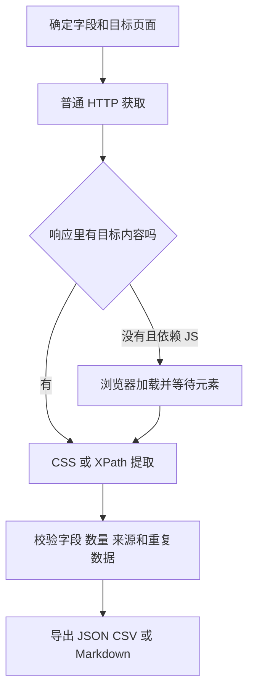

# Scrapling 从入门到实战

返回：[[07-工具与工作流/00-工具与工作流导航|工具与工作流导航]] · [[00-知识库首页]]

音视频下载配套：[[07-工具与工作流/网页采集/yt-dlp 音视频下载从入门到实战|yt-dlp 音视频下载从入门到实战]]。

## 1. 先理解它解决什么问题

Scrapling 是 Python 网页采集框架。你给出网址和提取规则，它负责获取页面、解析元素；需要批量采集时，再用 Spider 管理后续请求。典型输出是包含标题、作者、正文、来源地址等字段的 JSON，也可以直接生成 Markdown。

它包含三层能力：

| 层次 | 入口 | 负责什么 |
| --- | --- | --- |
| 获取页面 | `Fetcher` / `DynamicFetcher` / `StealthyFetcher` | HTTP 请求或浏览器加载 |
| 提取内容 | `Selector`、CSS、XPath、自适应匹配 | 从 HTML 中定位元素、取文本或属性 |
| 编排采集 | `Spider`、Request、Session | 跟进链接、并发、限速、会话、恢复和导出 |

不要把“浏览器中能看到内容”“HTTP 请求成功”“字段提取正确”当成同一件事。JavaScript 可能还没执行，页面可能是登录页，选择器也可能选错内容。



### 与其他工具怎么选

- 希望在一个库中完成 HTTP、动态页面和批量采集：可以优先试 Scrapling。
- 已有成熟 Scrapy 工程：先保留既有调度和管道；需要时按官方集成说明引入 Scrapling 解析器。
- 主要任务是验证点击、表单和业务流程：浏览器测试框架更贴近目标；采集成功不等于测试通过。
- 只是下载一个已知 JSON 接口：直接调用接口可能更清晰，没有必要强制经过 DOM。

这是选型建议，不是全站性能排名。项目基准主要衡量解析过程，不能推导整个采集任务的吞吐量。

## 2. 版本、资料与学习顺序

本文以 **Scrapling 0.4.15、Windows PowerShell、Python 3.10+** 为基线。官方源码核对提交：`28c329671485daaea89a40fb34a7db8622e51468`。依赖和 API 会变化，升级后应重新验证示例。

建议按以下顺序学习：

1. 安装虚拟环境，运行单页采集。
2. 看懂 CSS/XPath 和数据校验。
3. 运行两页 Spider，检查导出文件。
4. 安装浏览器，再尝试 JavaScript 页面。
5. 学会 Session、自适应定位和命令行提取。
6. 根据自己的站点加入登录、断点恢复及质量检查。

同目录 `Scrapling示例` 提供 `requirements.txt` 和四个独立 Python 脚本。以下 PowerShell 命令都在该示例目录中运行；它们是教程操作，不要求安装 Obsidian 插件。

## 3. Windows 安装：先把环境隔离好

### 3.1 创建虚拟环境

```powershell
python --version
python -m venv .venv
.\.venv\Scripts\python.exe -m pip install --upgrade pip
.\.venv\Scripts\python.exe -m pip install -r requirements.txt
.\.venv\Scripts\python.exe -m pip check
.\.venv\Scripts\python.exe -c "from importlib.metadata import version; print(version('scrapling'))"
```

最后应输出 `0.4.15`。本文直接调用虚拟环境中的解释器，不需要执行 `Activate.ps1`，也不需要修改全局 PowerShell 执行策略。

依赖文件固定 Scrapling 主版本，另装 Markdown 转换依赖：

```text
scrapling[fetchers]==0.4.15
markdownify>=1.2.0,<2
```

`pip install scrapling` 主要安装解析能力，不能据此假设浏览器及所有 Fetcher 依赖都已就绪。可选依赖用途如下：

| 安装项 | 用途 |
| --- | --- |
| `scrapling==0.4.15` | 仅解析已有 HTML |
| `scrapling[fetchers]==0.4.15` | HTTP 与浏览器抓取依赖 |
| `scrapling[shell]==0.4.15` | IPython 交互式采集 Shell |
| `scrapling[ai]==0.4.15` | MCP 等 AI 接入依赖 |

不必一开始装齐所有可选项。需要交互式 Shell 时再安装对应 extra。

### 3.2 浏览器文件需要单独安装

普通 HTTP 示例不需要启动 Chromium。运行动态页面示例前执行：

```powershell
.\.venv\Scripts\scrapling.exe install
```

该版本安装命令会调用 Playwright 下载 Chromium 并安装相关运行依赖。Python 包安装成功不代表浏览器下载完成。下载失败先处理网络、代理和磁盘问题，再重新执行；不要直接把失败提示当成可忽略信息。

如果已安装 Google Chrome，配套动态脚本也支持下列方式，会启动独立浏览器上下文：

```powershell
.\.venv\Scripts\python.exe -X utf8 03_dynamic.py --chrome
```

它对应 `real_chrome=True`，无需依赖该次 Chromium 下载。未安装 Chrome 时仍应先完成浏览器安装。此方式不会接管日常已打开的浏览器标签页。

### 3.3 保存可复现版本

```powershell
.\.venv\Scripts\python.exe -m pip freeze | Out-File -Encoding utf8 requirements-lock.txt
```

`requirements.txt` 是入门依赖声明，`requirements-lock.txt` 记录本机实际依赖版本；后者在不同操作系统之间不保证完全通用。升级先在新虚拟环境验证，再更新版本记录。

## 4. 第一个实战：抓取一页名言

目标站 `https://quotes.toscrape.com/` 是采集练习网站。每张名言卡片是 `.quote`，正文是 `.text`，作者是 `.author`。

运行：

```powershell
.\.venv\Scripts\python.exe -X utf8 01_static.py
```

核心调用是：

```python
from scrapling.fetchers import Fetcher

page = Fetcher.get("https://quotes.toscrape.com/", timeout=30, retries=1)
for card in page.css(".quote"):
    text = card.css(".text::text").get("")
    author = card.css(".author::text").get("")
    print(author, text)
```

完整脚本比这个最短示例多做了 HTTP 状态、空列表、字段非空检查，并将 UTF-8 JSON 写入 `output/quotes-page1.json`。练习站正常情况下首页有 10 条记录；实际输出以本次响应为准，网站改版应重新核对预期。

这里的 `timeout=30` 是 **30 秒**。`retries=1` 用于控制失败重试，不是控制返回条数。失败时不要通过删除数据检查来“让脚本成功”。

## 5. CSS 与 XPath：定位和取值是两步

| 表达式 | 含义 |
| --- | --- |
| `page.css('.quote')` | 取所有名言卡片 |
| `card.css('.text::text').get('')` | 第一段匹配文本；无结果返回空字符串 |
| `card.css('.tag::text').getall()` | 所有标签文本 |
| `page.css('li.next a::attr(href)').get()` | 下一页相对地址 |
| `card.xpath('.//small[@class="author"]/text()').get()` | 在当前卡片内查作者 |

注意以下三个细节：

1. `.get()` 只取第一个结果；需要完整列表时使用 `.getall()`。
2. 在卡片内使用相对 XPath `.//`，避免从整页反复取到同一个作者。
3. `::text` 通常取直接文本节点。遇到 `<p>正文<strong>重点</strong></p>`，可以用 `node.xpath('string(.)').get()` 汇总后代文本，再按业务规则清洗空白。

浏览器开发者工具可以帮助定位 DOM，但复制出的长路径容易随布局变化失效。优先选择稳定的语义属性或容器关系，避免把第几个节点当成业务身份。

调试时先打印页面标题、最终 URL、状态和匹配数量，再逐层缩小选择器。`200 + 0 条记录` 是需要排查的结果，不是自动成功。

## 6. 两页采集：Spider 怎么工作

运行完整示例：

```powershell
.\.venv\Scripts\python.exe -X utf8 02_spider.py
```

它只采集首页和 `/page/2/`，预期 20 条，避免初次练习无边界跟进链接。关键机制如下：

- `start_urls` 指定入口；`allowed_domains` 限定域名，但也允许该域名的子域名，不是严格的完整 URL 白名单。
- `async def parse()` 解析响应；`yield dict` 输出数据，`yield response.follow(...)` 交给框架安排后续请求。
- `response.follow()` 负责拼接相对地址，不需要手工连接域名。
- `concurrent_requests_per_domain = 1` 配合 `download_delay = 1.0`，让初次采集节奏较保守。
- `robots_txt_obey = True` 显式开启站点抓取规则检查；该版本默认没有开启。

脚本检查完成标记、20 条记录和业务键去重后，生成：

```text
output/quotes-two-pages.json
output/quotes-two-pages.csv
```

**`result.completed` 不是“所有业务数据都正确”的证明。** 还应检查日志、失败请求、字段完整性、来源页面以及数量。示例里的 20 是练习站的验收条件，换站点时要根据真实规则重新设计。

扩展到全部分页时，可以把脚本中的 `if next_url == '/page/2/':` 改成 `if next_url:`，但应先设置总页数/时间预算并核实站点范围。请求去重也不等于数据去重，同一条内容可能出现在多个 URL。

### JSON、CSV、JSONL 怎么选

JSON 适合嵌套字段；CSV 便于人工查看平面表格；JSONL 每行一条，适合逐条处理。框架提供 `to_json()`、`to_csv()`、`to_jsonl()`。注意：**对 `result.items` 调用 `to_jsonl()` 仍然是结束后导出**，它本身不解决整个任务把记录放在内存中的问题。

大任务应使用官方 streaming 模式或 `on_scraped_item` 配合外部持久化，边采集边写入，并设计唯一键和失败恢复。Excel 打开 CSV 乱码时按 UTF-8 导入；列表字段通常还需要按业务需求展平。

## 7. 动态网页：等待目标元素出现

如果 HTTP 响应中没有目标字段，但浏览器里存在，先确认是否由 JavaScript 或后台接口生成。需要渲染时：

```powershell
.\.venv\Scripts\python.exe -X utf8 03_dynamic.py
```

核心配置：

```python
from scrapling.fetchers import DynamicFetcher

page = DynamicFetcher.fetch(
    "https://quotes.toscrape.com/js/",
    headless=True,
    wait_selector=".quote .text",
    timeout=30000,
    disable_resources=False,
    google_search=False,
)
print(page.css(".quote .text::text").getall())
```

这里的 `timeout=30000` 是 **毫秒**，与 `Fetcher` 的秒不同。`wait_selector` 表达真正等待的内容，比固定睡几秒更贴近需求。`network_idle=True` 是可选条件，长期轮询或长连接页面可能一直无法满足，不建议盲目开启。

`disable_resources=False` 保留资源以先验证正确性；确认页面不会依赖被拦截资源后再优化。返回的 `page` 是 Scrapling 响应，不能在它上面继续按 Playwright Page 使用 `.click()`。

### 点击、滚动和懒加载

交互写在 `page_action` 回调里。下面是**必须按目标站点替换定位器的结构示例**，不是可直接验证任意站点的脚本：

```python
def reveal_items(browser_page):
    browser_page.locator("button.load-more").click()
    browser_page.locator(".item.loaded").first.wait_for(state="visible")

# DynamicFetcher.fetch(target_url, page_action=reveal_items, timeout=30000)
```

如果要多次滚动，限制最大轮数，并比较新增条目数；不要写没有退出条件的无限循环。动态抓取负责加载和交互，字段正确性仍要自己检查。

## 8. Session、登录状态与异步

同一站点要连续请求时，用 Session 复用连接和 Cookie：

```python
from scrapling.fetchers import FetcherSession

with FetcherSession() as session:
    first = session.get("https://quotes.toscrape.com/", timeout=30)
    second = session.get("https://quotes.toscrape.com/page/2/", timeout=30)
    print(first.status, second.status)
```

浏览器对应 `DynamicSession`，异步浏览器对应 `AsyncDynamicSession`。重复使用 Session 可以减少反复启动浏览器的开销；`with`/`async with` 负责释放资源。

登录采集需要先完成目标站的正常登录流程，再让后续请求复用同一会话。跨进程持久化可使用专用 `user_data_dir`，但不要直接指向日常浏览器主配置目录。Cookie、用户目录和原始响应可能含敏感数据，不要随教程提交。

需要并发多个动态页面时，可以用 `AsyncDynamicSession(max_pages=2)` 配合 `asyncio.gather()`。同步脚本不要随意套进已有事件循环；在 Notebook 或异步服务中参考对应异步 API。限速、域名范围和数据校验仍需保留。

## 9. 自适应选择器：怎样用才不会悄悄抓错

它不是让大模型理解页面，而是存储元素特征，再按相似度重新定位。基本过程是：

1. 页面正常时启用 `adaptive=True`。
2. 使用 `auto_save=True` 保存已确认正确的元素特征。
3. 页面变更后，使用原选择器加 `adaptive=True` 尝试找回。
4. 用稳定业务标识、数量、文本或结构条件再次确认。

运行本地演示，无需网络：

```powershell
.\.venv\Scripts\python.exe -X utf8 04_adaptive.py
```

脚本使用两份 HTML，把商品元素 ID 从 `old-card` 改成 `new-card`，保留 `data-sku="DEMO-001"`。先确认普通选择器返回空，再确认自适应返回一条且 SKU 正确。特征数据库放在忽略的 `output/adaptive.db` 中。

默认存储是 SQLite。保存和恢复时要使用一致的 URL/域名、标识和存储配置。没有保存过特征时不能凭空恢复；域名改变时还要考虑 `adaptive_domain`。

> [!warning] 自适应只提供候选元素
> 最高相似度不等于正确业务对象。尤其是金额、账号、商品身份等字段，恢复后应有明确断言；无法确认时输出待复核记录。不要把错误匹配再次保存为新的正确基线。

## 10. 命令行提取网页到 Markdown

从示例目录运行：

```powershell
New-Item -ItemType Directory -Force output | Out-Null
.\.venv\Scripts\scrapling.exe extract get "https://quotes.toscrape.com/" output/quotes.md --css-selector ".quote"
.\.venv\Scripts\scrapling.exe extract get --help
.\.venv\Scripts\scrapling.exe extract fetch --help
```

`get` 使用 HTTP，`fetch` 使用动态浏览器；文件后缀 `.md`、`.txt`、`.html` 决定输出形式。选择主要内容容器，可以减少导航、广告和页脚。

采集到 Markdown 不代表已经成为高质量知识笔记。导入 Obsidian 前补上标题、来源 URL、采集日期、摘要和自己的判断，再添加相关双链；不要覆盖人工维护的笔记。建议先放入收集箱，审核后归类。

可选交互式 Shell：安装 `scrapling[shell]==0.4.15` 后运行 `.\.venv\Scripts\scrapling.exe shell`。本文基础示例不依赖它。

## 11. StealthyFetcher、MCP 与扩展能力

`StealthyFetcher` 提供针对自动化识别的浏览器能力，调用形式为 `StealthyFetcher.fetch(...)`。它不是无限制访问的保证；遇到 403、429、验证码或登录跳转，先识别响应和权限问题，按站点要求处理并限制重试。本教程不把任何防护系统的通过率写成已验证结论。

Scrapling 还提供 MCP 服务，安装 `scrapling[ai]==0.4.15` 后可通过 `scrapling mcp --help` 查看参数。MCP 是给支持该协议的客户端调用采集工具，不是编写 Python 爬虫的必需步骤。具体接入方式、传输模式和认证请以官方 MCP 文档为准；本文未改动任何客户端配置。

命令行清洗或 Markdown 转换也不能保证网页中的指令可信。向 AI 提供抓取内容时，把内容当成外部资料，不应让网页文字触发额外工具操作。

## 12. 长任务与工程化

小任务可以结束后统一导出；长任务建议增加以下内容：

| 关注点 | 实施方式 |
| --- | --- |
| 断点 | `QuotesSpider(crawldir='./output/crawl-state').start()`；正常 Ctrl+C 后使用同一路径恢复 |
| 结果持久化 | 边采集边写入，按业务键幂等；请求恢复不自动保证外部输出完整 |
| 调速 | 按站点设置并发/延迟，需要时启用 `autothrottle_enabled` |
| 排错 | 保存失败 URL、状态、异常类别、脱敏页面样本 |
| 开发复现 | 用本地 HTML 或开发缓存调试解析；缓存结果不能证明线上仍然正常 |
| 版本记录 | Python、Scrapling、浏览器和依赖版本一起记录 |
| 质量 | 非空、格式、唯一性、数量范围、来源、跨页一致性 |

当前两页示例没有启用断点，也没有验证强制结束后的恢复。要建设长期任务，先用可控小站测试中断、恢复、重复数据与部分失败，再扩大规模。

## 13. 常见问题排查

| 现象 | 优先检查 | 处理 |
| --- | --- | --- |
| `ModuleNotFoundError` | 是否用错解释器、是否缺 extra | 使用 `.venv` 完整路径安装与执行 |
| 找不到浏览器可执行文件 | Python 包装好但浏览器未下载 | 运行 `scrapling install` 并检查退出码 |
| pip 哈希不匹配 | 下载是否截断、缓存/代理是否异常 | 保留校验；更新 pip，可靠网络重试，必要时禁用缓存重新下载 |
| HTTP 200 但没有记录 | 登录页、挑战页、JS、选择器 | 看最终 URL/标题/内容，再选合适 Fetcher |
| 动态等待超时 | 错误选择器、页面未加载、资源被拦 | 检查目标元素，保留资源，按需调整超时 |
| 超时时间怪异 | 秒和毫秒混淆 | HTTP 30 秒对应浏览器 30000 毫秒 |
| 403/429 | 权限、限流、站点策略 | 停止盲目重试，降低频率并检查访问条件 |
| HTTPS 证书异常 | 系统时间、代理 CA、证书链 | 修复信任配置，不用关闭校验掩盖问题 |
| 数据重复 | 多 URL 同一对象、恢复后重复写入 | 增加业务唯一键和幂等写入 |
| 中文乱码 | 保存和读取编码 | JSON 用 UTF-8；CSV 按 UTF-8 导入 |
| 自适应定位错误 | 保存基线、域名和候选相似性 | 校验业务标识，失败记录待人工检查 |

## 14. 本次验证记录

验证日期：2026-09-09。实际运行环境：Windows、Python 3.10、Scrapling 0.4.15、Playwright 1.62.0、curl_cffi 0.16.3。以下是本次运行记录，不是所有机器或站点的保证。

| 检查 | 结果 | 证据摘要 |
| --- | --- | --- |
| 隔离安装与依赖检查 | 通过 | 更新 pip 后安装成功；`pip check` 无冲突 |
| `01_static.py` | 通过 | HTTP 200，10 条；JSON 可解析，正文/作者/来源非空 |
| `02_spider.py` | 通过 | 2 个内容请求均为 200；20 条；failed_requests_count=0；completed=True |
| JSON/CSV 导出 | 通过 | JSON 20 条，CSV 20 行；业务键无重复 |
| `04_adaptive.py` | 通过 | 普通匹配 0，自适应匹配 1，SKU 为 DEMO-001 |
| CLI Markdown | 通过 | 输出文件非空且可按 UTF-8 读取 |
| `03_dynamic.py --chrome` | 通过 | JavaScript 页面 HTTP 200，渲染后提取 10 条 |
| 默认 Chromium 路径 | 未通过环境准备 | 下载时 server closed connection；直接运行提示浏览器不存在，已停止该次下载 |
| Python 语法与知识库链接 | 通过 | 四个脚本解析通过；本次检查 36 篇笔记，broken_links=0 |
| Obsidian 阅读视图 | 未验证 | 仅完成文件结构、代码块配对和双链校验，未在桌面阅读视图验收 |

补充：练习站 `/robots.txt` 本次返回 404，框架随后采集两页；这不构成对其他站点抓取规则的判断。安装初次遇到 wheel 哈希不匹配，更新 pip 后重试成功，没有绕过哈希或 TLS 校验；未断言最初失败的根因。

网站防护、真实登录、代理、MCP 接入及长任务恢复不属于本次实测范围。输出数据、虚拟环境、SQLite 与下载缓存未提交到仓库。未来复测应重新执行上述命令，并记录新版本和实际结果。

## 15. 官方来源

下列文档及相应源码用于核对 API；正文是按实操流程重新组织的说明，示例进行了范围限制和数据校验。

- [项目与版本](https://github.com/D4Vinci/Scrapling)
- [固定源码基线](https://github.com/D4Vinci/Scrapling/tree/28c329671485daaea89a40fb34a7db8622e51468)
- [依赖与 Python 版本](https://github.com/D4Vinci/Scrapling/blob/28c329671485daaea89a40fb34a7db8622e51468/pyproject.toml)
- [HTTP 获取](https://scrapling.readthedocs.io/en/latest/fetching/static/)
- [动态页面与参数](https://scrapling.readthedocs.io/en/latest/fetching/dynamic/)
- [元素选择](https://scrapling.readthedocs.io/en/latest/parsing/selection/)
- [自适应解析](https://scrapling.readthedocs.io/en/latest/parsing/adaptive/)
- [Spider 入门](https://scrapling.readthedocs.io/en/latest/spiders/getting-started/)
- [并发、恢复和生命周期](https://scrapling.readthedocs.io/en/latest/spiders/advanced/)
- [命令行提取](https://scrapling.readthedocs.io/en/latest/cli/extract-commands/)
- [MCP 文档](https://scrapling.readthedocs.io/en/latest/ai/mcp-server/)
- [Scrapy 集成](https://scrapling.readthedocs.io/en/latest/integrations/scrapy/)
